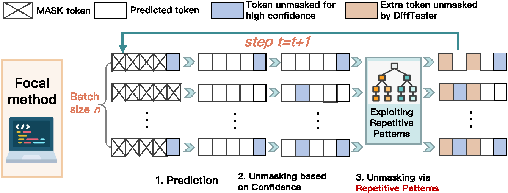

# DiffTester: Accelerating Unit Test Generation for Diffusion LLMs via Repetitive Pattern

Official implementation of the paper:
**DiffTester: Accelerating Unit Test Generation for Diffusion LLMs via Repetitive Pattern**

---

## 📖 Overview

Software development relies heavily on extensive unit testing, making the efficiency of automated Unit Test Generation (UTG) crucial. While diffusion large language models (dLLMs) show promise for efficient parallel test generation, they often face a trade-off between **efficiency** and **generation quality**.

💡 **DiffTester** is an acceleration method designed for dLLMs in UTG.

The key idea is simple yet powerful: unit tests targeting the same focal method often share **repetitive structural patterns**. By dynamically identifying these patterns through **AST analysis** during generation, DiffTester adaptively increases the number of tokens unmasked at each step **without sacrificing quality**. An overview of DiffTester is shown below:

<p align="center">
  
</p>

---

## 🔧 Installation

```bash
pip install -r requirements.txt
```

For java, you need to install JDK17 and maven.

```bash
wget https://download.oracle.com/java/17/archive/jdk-17.0.12_linux-x64_bin.tar.gz
wget https://dlcdn.apache.org/maven/maven-3/3.9.11/binaries/apache-maven-3.9.11-bin.tar.gz
tar -zxvf jdk-17.0.12_linux-x64_bin.tar.gz
tar -zxvf maven-mvnd-1.0.2-linux-amd64.tar.gz
export JAVA_HOME=~/jdk-17.0.12
export PATH=$PATH:$JAVA_HOME/bin
export MAVEN_HOME=~/apache-maven-3.9.11
export PATH=$PATH:$MAVEN_HOME/bin
```

For cpp, you need to support C++20 standard.

---

## 🏃‍♀️ Usage

After environment preparation, you can run the following command to reproduce the **main results** in our paper.

```bash
./run_all.sh
```

> Note: to enable acceleration, the evaluation code will replace `generate_utils.py` in the model folder with `./generate_utils_diffucoder.py`. Please make sure that `generate_utils.py` in your model folder is writable.

## 📑 Model links

[DiffuCoder model](https://huggingface.co/apple/DiffuCoder-7B-cpGRPO/tree/main)

[Dream-Instruct model](https://huggingface.co/Dream-org/Dream-v0-Instruct-7B/tree/main)

